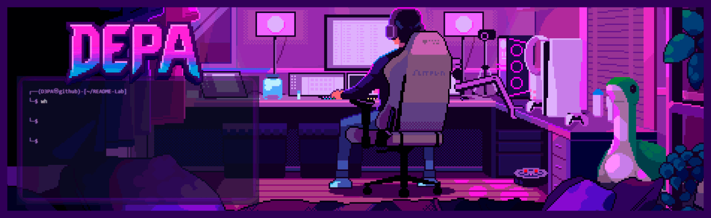
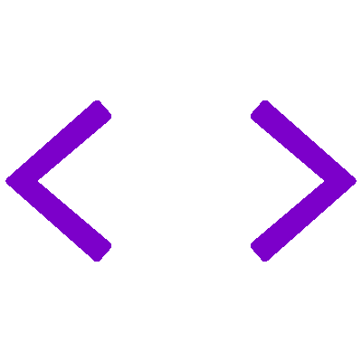
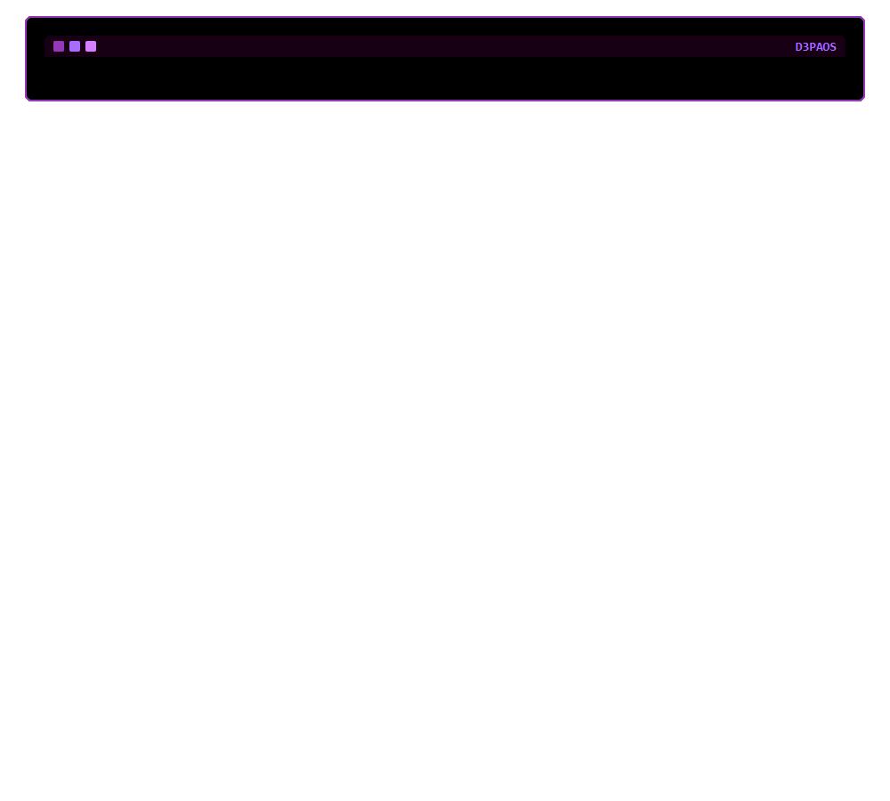

<!--count badge-->

  

<!--banner image-->

<!--title-->

  

<table align="right">
 <tr><td><a href="https://github.com/D3PA">English</a></td></tr> 
 <tr><td><a href="https://github.com/D3PA">Spanish</a></td></tr>
</table>

 

<!--about me-->
##  Who Am I?

<!--right image-->

  

<!--about me info-->
I’m 28 years old and my journey in programming started back in 2004, when I was just 8. At the time, my brother was studying Computer Engineering, and watching him work on the computer inspired me to try and replicate what he was doing.

I began programming with ***Visual Basic 6***, then gradually explored other languages such as ***C, C++, Java***, and even challenged myself with ***Assembly***. Over time, this passion grew into a career as a Software Developer and later as a Fullstack Developer.

Currently, I’m focusing on my growth as a QA Engineer, while also transitioning my career into Cybersecurity. I’m especially interested in Pentesting and security practices, aiming to combine my QA background with security expertise to become a QA Security Specialist.

-  I’m currently learning **Quality Assurance** and **Cybersecurity**
-  I’m looking to collaborate on Open Source Projects
-  Visit my [Portfolio](https://github.com/D3PA) for more details about me. (Under construction)
-  I’m here to leave digital scars, not forgotten folders. 
-  All of my projects are available at [GitHub](https://github.com/D3PA?tab=repositories)

 

<!--technical skills table-->

  
##  Technical Skills

 

<!--connect with me-->

  
##  Connect with me

Do you want to contact me for collaboration opportunities? 
<table>
  <tr>
    <td width="40%">
      
    </td>
    <td width="60%">
      

      

      
        &emsp;
      
        &emsp;
       
      

      
Leave me a bug report, meme, or just a random hello <a href="https://github.com/D3PA/D3PA/issues/new?template=guestbook-entry.md">here</a>!

      
Ask me anything… I’ll probably regret saying that in <a href="https://github.com/D3PA/D3PA/discussions/new/choose">discussions</a>!

  
        Yeah, this is the part where I tell you to “follow me” 
        like I’m some kind of influencer. Spoiler: I’m not.   
        But hey, if you want to talk code, throw project ideas at me, 
        or just spam me with nonsense because you’re bored,    
        go ahead – I won’t bite. Worst case, I ignore you. 
        Best case, we build something cool.  
        So, pick a link below and let’s see what kind of projects we can start. 
  </tr>
</table>

<!--github overview-->

  
##  GitHub Overview

<table width="100%">
  <tr>
    <td width="50%">
      

        
      

    </td>
    <td width="50%">
      

        
      

    </td>
  </tr>
   <tr>
    <td width="50%">
      

        
      

    </td>
    <td width="50%">
      

        
      

    </td>
  </tr>
</table>

<!-- snake purple -->

  

<!-- snake purple -->

<!--update quote at 00:00 argentina-->

  
##  What I’m Thinking Today

<!--TARJETA_INICIO-->

  

<!--TARJETA_FIN-->

---

<!--final-->

  
**Made with  and lots of  by Rodrigo Muñoz**

<!--final-->

